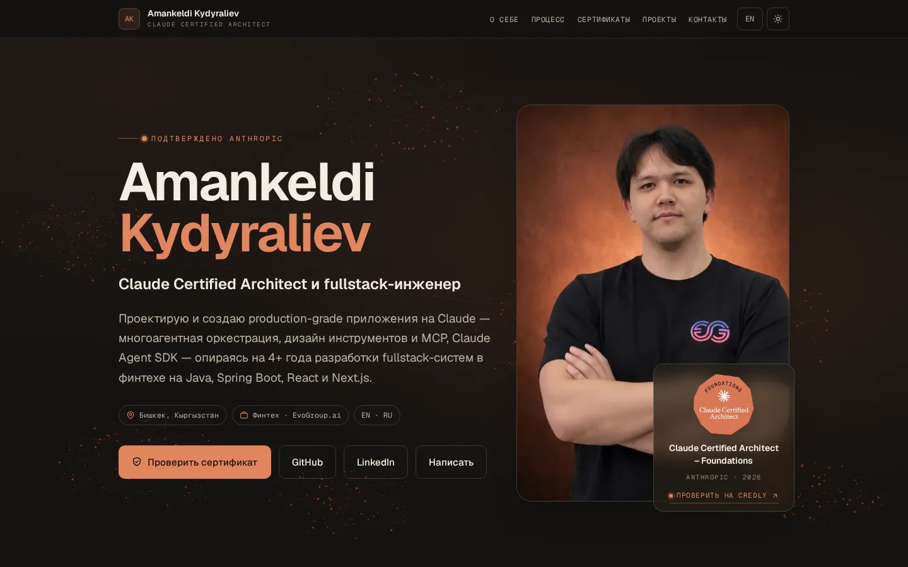
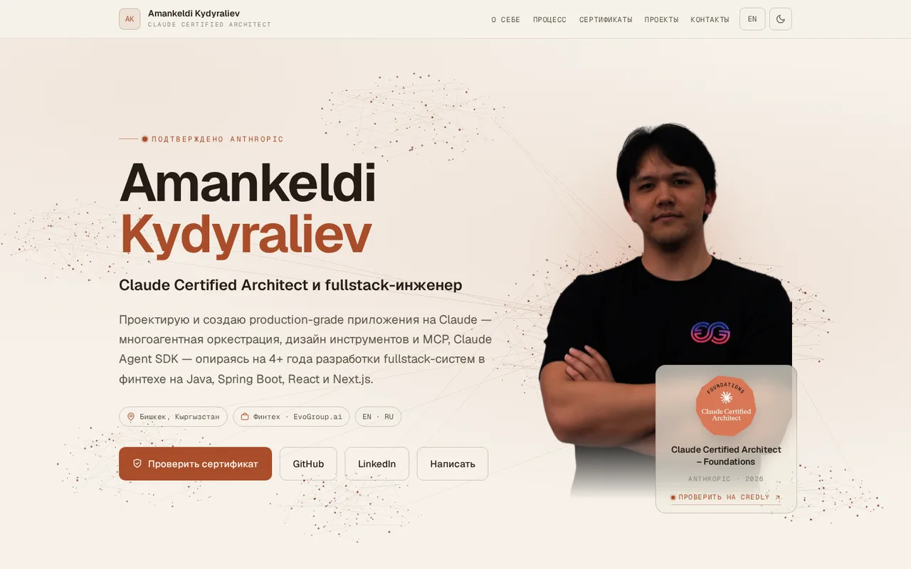
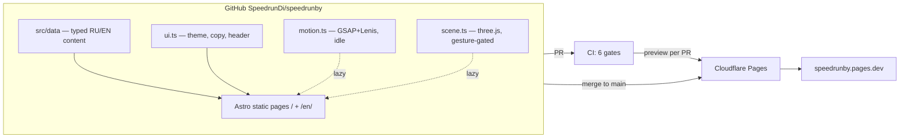

# speedrunby

> Personal portfolio of **Amankeldi Kydyraliev** — Claude Certified Architect & fullstack engineer.
> **Live: [speedrunby.pages.dev](https://speedrunby.pages.dev)**

Bilingual (RU default / EN), dark-first theming, a lazy WebGL hero and a hard
performance budget — built as a portfolio artifact in itself: this repository
is meant to be read.

| Dark (default)                                     | Light                                                |
| -------------------------------------------------- | ---------------------------------------------------- |
|  |  |

## Highlights

- **Agent-orchestration constellation** — ~1000 GPU particles in 6 clusters with
  travelling signal pulses and a pointer attractor; vanilla three.js in a single
  lazy chunk, gesture-gated so it never touches the initial-load window
- **Depth-parallax portrait** — the Facebook-3D-photo technique: photo + 2 KB
  depth map in a shader plane (fine pointers only, static fallback stays)
- **Motion with a conscience** — CSS-only hero entrance (zero LCP cost), GSAP +
  Lenis load at idle behind a fail-safe loader, full `prefers-reduced-motion`
  path, content can never be lost if a chunk fails
- **i18n without runtime JS** — RU at `/`, EN at `/en/`; every string statically
  rendered from typed `L<ru,en>` data modules, hreflang pair + sitemap alternates
- **Zero third-party requests** — fonts self-hosted per-subset, CSP
  `default-src 'self'`, HSTS preload, immutable asset caching
- **Confidentiality as a CI invariant** — a post-build grep over the whole tree
  - dist with needles sourced only from a secret (never stored in the repo)

## Architecture



## Quality gates (every PR)

| Gate                            | Enforced by                                         |
| ------------------------------- | --------------------------------------------------- |
| Types & content schemas         | `astro check`, `tsc`, zod (`validate-content.mjs`)  |
| Lint & format                   | ESLint 9 flat (astro + jsx-a11y), Prettier          |
| Performance / a11y / SEO ≥ 0.95 | Lighthouse CI on `/` and `/en/`, 3 runs             |
| Resource budgets                | script ≤ 350 KB, total ≤ 1 MB (LHCI assertions)     |
| E2E smoke                       | Playwright on chromium + **firefox** (16 specs)     |
| Internal links                  | lychee offline over `dist/`                         |
| Dependencies                    | `pnpm audit` (critical blocks) + grouped Dependabot |
| Confidentiality                 | post-build grep, fail-closed in CI                  |

## Getting started

```sh
pnpm install
pnpm dev       # local dev server
pnpm build     # production build to dist/ (regenerates OG cards)
pnpm preview   # serve the production build
pnpm test:e2e  # Playwright smoke
pnpm lhci      # local Lighthouse CI run
```

Requires Node ≥ 22 (`.node-version`) and pnpm 10 (`packageManager`).
Ops details live in [`docs/RUNBOOK.md`](docs/RUNBOOK.md).

## Stack

Astro 6 (static) · Tailwind CSS v4 · GSAP + Lenis · three.js · TypeScript strict · pnpm
· Cloudflare Pages (native Git integration, PR previews)

## License

Source code is MIT-licensed (see `LICENSE`). Site content — texts, images,
photos, CV data, personal branding — is © the author, all rights reserved.

---

## По-русски (кратко)

Личное портфолио: Claude Certified Architect и fullstack-инженер. Двуязычный
статический сайт на Astro 6 с WebGL-констелляцией «оркестрации агентов»,
2.5D-параллаксом портрета и жёсткими бюджетами производительности
(Lighthouse ≥ 95 на каждый PR). Репозиторий — сам по себе часть портфолио:
CI из 8 гейтов, конфиденциальность как инвариант сборки, полная поддержка
reduced-motion. Код — MIT; контент — все права защищены.
